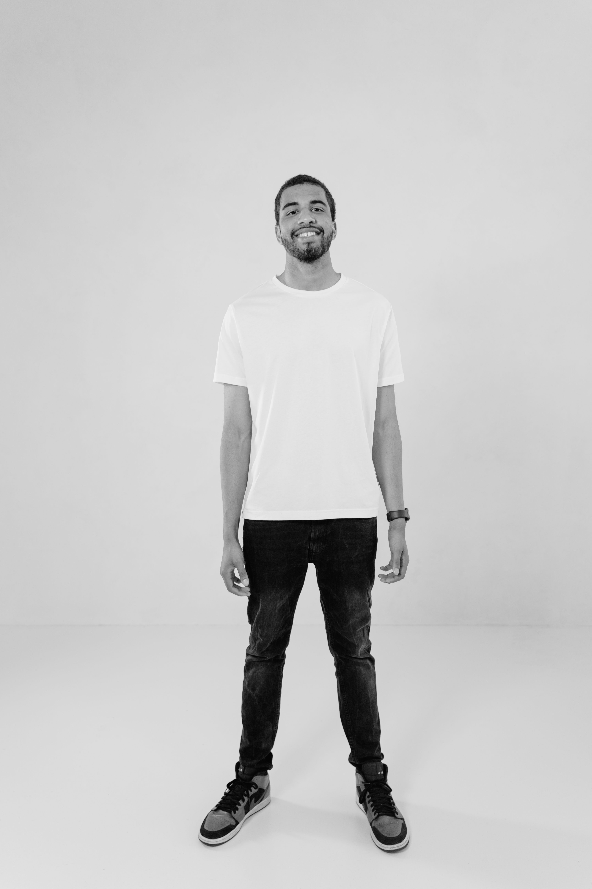
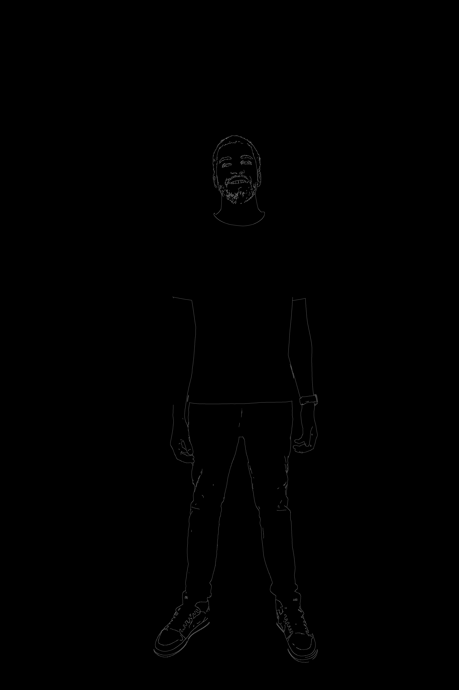
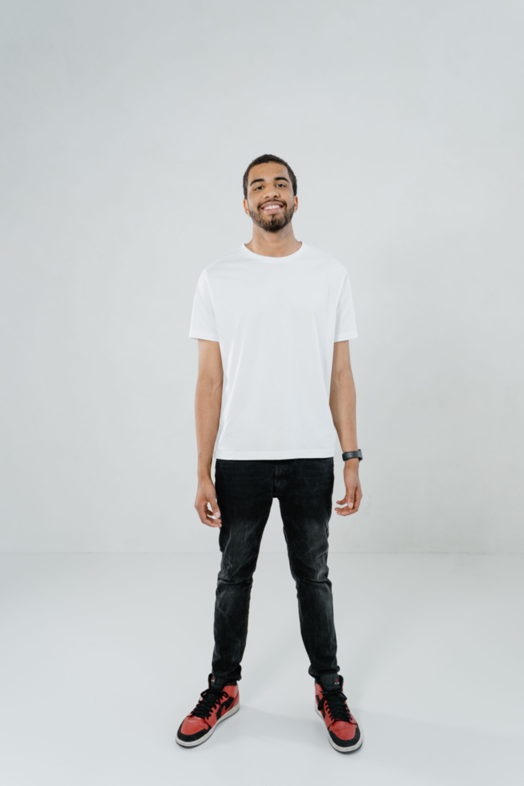
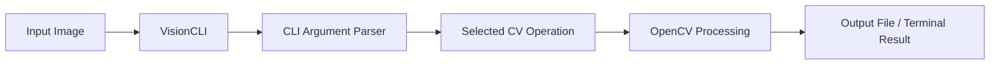
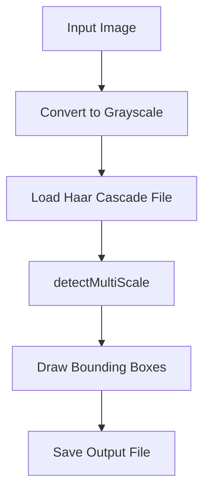
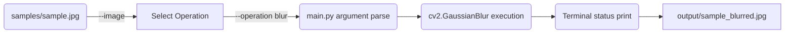

# VisionCLI

A Python-based command-line Computer Vision toolkit using OpenCV.

VisionCLI provides a simple and fast interface for performing essential computer vision operations natively from the terminal. 

---

## Quick Overview

**What VisionCLI is:** A simple, headless student project designed to demonstrate core computer vision processes without complex graphical user interfaces.
**Why it exists:** To provide an easy-to-use, robust example of parsing terminal commands and wiring them up to Python's powerful OpenCV module.
**How you interact with it:** Users invoke the `main.py` Python script via standard terminal environments, passing an input image along with the desired operation flag.
**What it produces:** Processed `.jpg` or `.png` images strictly piped to an output directory, natively skipping GUI window popups.

---

## Visual Demo / Gallery

Below are the actual visual results generated out-of-the-box by VisionCLI.

| Original Image | Grayscale Conversion |
|:---:|:---:|
| <br>*Original sample input* | <br>*`--operation grayscale`* |

| Canny Edge Detection | Face Detection |
|:---:|:---:|
| <br>*`--operation edges`* | <br>*`--operation faces`* |

| Gaussian Blur | Resized Image (800x600) |
|:---:|:---:|
| <br>*`--operation blur`* | <br>*`--operation resize` --width 800 --height 600* |

---

## How It Works

### General Architecture



### Face Detection Pipeline



---

## Features

VisionCLI packages six core operations implemented safely into modular files:

**1. Image Information**
* **What it does:** Extracts key file traits without modifying the image.
* **Technique:** Leverages OpenCV's `.shape` attribute and OS file attributes.
* **Output:** Logs the path, internal dimensions, pixel channels, and computed filesize to the terminal.

**2. Grayscale Conversion**
* **What it does:** Strips color channels to leave luminosity intensity.
* **Technique:** `cv2.cvtColor` mapped to `cv2.COLOR_BGR2GRAY`. 
* **Output:** A single-channel grayscale image saved to disk.

**3. Canny Edge Detection**
* **What it does:** Traces contrast boundaries, rendering structures and geometry.
* **Technique:** `cv2.Canny` (lower threshold 100, upper 200). 
* **Output:** A stark black-and-white mask saved to disk highlighting edges.

**4. Haar Cascade Face Detection**
* **What it does:** Automatically discovers human faces inside an image.
* **Technique:** Machine-learning object detection via OpenCV Haar Casacde (`haarcascade_frontalface_default.xml`).
* **Output:** Terminal count of valid faces, and a visual copy featuring green bounding box highlights saved to disk.

**5. Image Resizing**
* **What it does:** Mathematically scales coordinates.
* **Technique:** `cv2.resize`.
* **Output:** A scaled-down or scaled-up equivalent of the image according to arguments.

**6. Gaussian Blur**
* **What it does:** Softens image details and neutralizes high-frequency noise.
* **Technique:** `cv2.GaussianBlur` via a 15x15 kernel scope.
* **Output:** A smooth, blurred export saved to disk.

---

## Computer Vision Concepts

* **Color vs Grayscale:** Standard screens interpret colors via 3 distinct combinations of Red, Green, and Blue (RGB) pixel values. Grayscale eliminates the hue, interpreting everything as a single luminance channel from 0 (black) to 255 (white).
* **Dimensions & Channels:** The height x width geometry in pixels forms the dimensions. The depth forms channels (e.g. RGB is 3 channels, RGBA is 4).
* **Canny Edge Detection:** A well-known gradient-thresholding algorithm that tracks strong intensity shifts between connected pixels to mathematically isolate boundaries and visual "edges".
* **Haar Cascades:** An older yet highly optimized machine-learning object detection technique. It slides thousands of tiny rectangular contrasts ("Haar-like features") over the image, rejecting negative matches until a human face is confidently highlighted. 
* **Gaussian Blur:** Convolution mathematics where a pixel's value is smoothly averaged against its physical neighbors following a bell-curve (Gaussian) distribution, dropping visual noise.

---

## Installation

**1. Clone the repository:**
```bash
git clone <repository_url>
cd VisionCLI
```

**2. Create a virtual environment:**
```bash
python -m venv venv
```

**3. Activate the virtual environment:**

Windows:
```bash
venv\Scripts\activate
```
macOS/Linux:
```bash
source venv/bin/activate
```

**4. Install dependencies:**
```bash
pip install -r requirements.txt
```

---

## Quick Start

Execute a simple grayscale conversion on the included sample image:
```bash
python main.py --image samples/sample.jpg --operation grayscale
```
*Your file will immediately materialize locally inside the `output/` directory as `sample_grayscale.jpg`.*

---

## Complete Command Reference

Ensure your terminal `cwd` is identical to `main.py` and invoke `--help` at any time to overview arguments:

```bash
python main.py --help
```

**Information**
Scans image traits via OS sizing and OpenCV array properties. Terminal logs only.
```bash
python main.py --image samples/sample.jpg --operation info
```

**Grayscale** 
Calculates luminance output. Saved to `output/`.
```bash
python main.py --image samples/sample.jpg --operation grayscale
```

**Edge Detection**
Trims gradients into black/white lines. Saved to `output/`.
```bash
python main.py --image samples/sample.jpg --operation edges
```

**Face Detection** 
Predicts bounding rects. Saved to `output/`.
```bash
python main.py --image samples/sample.jpg --operation faces
```

**Resizing**
Scales resolution exactly to input integers. Saved to `output/`.
```bash
python main.py --image samples/sample.jpg --operation resize --width 800 --height 600
```

**Blurring** 
Combats noise / renders softer background. Saved to `output/`.
```bash
python main.py --image samples/sample.jpg --operation blur
```

---

## Argument Reference

| Argument | Requirement | Description |
|---|---|---|
| `--image` | **Required** | The relative or absolute path indicating the target image script. |
| `--operation` | **Required** | The explicit task to execute. Strict choices: `info`, `grayscale`, `edges`, `faces`, `resize`, `blur`. |
| `--width` | *Context Dependent* | Integer pixel dimension to scale. Required strictly when operation is set to `resize`. |
| `--height` | *Context Dependent* | Integer pixel dimension to scale. Required strictly when operation is set to `resize`. |
| `--outdir` | *Optional* | The targeted save directory for generated assets (Defaults implicitly to `output/`). |

---

## Example Workflow



---

## Project Structure

```text
VisionCLI/
├── .gitignore
├── LICENSE
├── README.md
├── requirements.txt
├── main.py
├── cv_operations/
│   ├── __init__.py
│   ├── blur.py
│   ├── edges.py
│   ├── face_detection.py
│   ├── grayscale.py
│   ├── image_info.py
│   └── resize.py
├── docs/
│   └── images/
├── output/
│   └── .gitkeep
└── samples/
    └── sample.jpg
```

* **`main.py`**: The entrypoint module handling validation, routing, and all `argparse` configurations.
* **`cv_operations/`**: Modularized scripts logically splitting up explicit Computer Vision behavior logic.
* **`requirements.txt`**: Minimal dependency map ensuring Python environment compliance.

---

## Error Handling

Validation is implemented upstream natively in Python:
* **Missing Image:** Checks file path existence natively before importing `cv2` and halts softly if it does not exist.
* **Invalid Image Data:** Validates `cv2.imread()` arrays to verify structural pixel integrity.
* **Invalid Operation:** Denied preemptively by parsing strict `argparse` choices natively before instantiation.
* **Resize Argument Errors:** Custom checks halt script execution correctly if exactly `--width` and `--height` integers aren't paired contextually with `--operation resize`.

---

## Testing

VisionCLI relies strictly on comprehensive manual command validation. Operations have been explicitly verified on Windows platforms leveraging test imagery (e.g. `samples/sample.jpg`). Missing flag constraints correctly reject parsing.

---

## Technology Stack

* **Python 3:** Highly accessible scripting backbone.
* **OpenCV (`opencv-python`):** Industry-standard C++ bindings handling optimized array pixel transformations natively. 
* **NumPy:** Leveraged under the hood via OpenCV for robust N-Dimensional matrix calculus.
* **argparse:** The native Python core library ensuring command-line interfaces are robust and readable without third-party frameworks.

**Design Approach:** 
A CLI environment was chosen to preserve robust speed against image data while dodging GUI overhead complexities. The script routes commands away from `main.py` into `cv_operations` components ensuring a clean separation of concerns without inventing unnecessarily rigid object oriented boilerplate. The explicit output directory enforces nondestructive behavior against user inputs.

---

## Limitations

* Due to inherent limitations of Haar Cascades, `face_detection` models standard frontal human structures—it struggles severely against dramatic rotations, poor lighting profiles, and occlusions.
* VisionCLI operates singularly on distinct spatial static image representations formats (e.g., `.jpg`, `.png`). Runtime temporal pixel streams (webcams/video) are not supported.
* Algorithm parameters (e.g., Canny gradient limits) are hard-bound at runtime.

---

## Future Improvements

* Inject terminal arguments unlocking dynamic configurations for Blur intensities and Threshold limits.
* Broadening Haar Cascade scope to interpret object profiles specifically (eyes, smiles, bodies).

---

## Troubleshooting 

* **"ModuleNotFoundError: cv2"**: Double check that the virtual environment has installed execution requirements contextually via `pip install -r requirements.txt`. 
* **"AttributeError: module 'cv2' has no attribute 'CascadeClassifier'"**: This specifically highlights an OpenCV latest version incompatibility context. Reinstall the bound exacted version dictated by `requirements.txt` (`opencv-python<5.0.0`).
* **OpenCV Cannot Read Image Error**: Typically denotes an image file is physically invalid, heavily damaged, or completely missing from its specified path string. 

---

## License

This project relies on standard open-source distribution under the MIT License constraints. You are completely free to utilize, fork, and implement this logic openly without restriction. See `LICENSE` explicitly for exact conditions.
